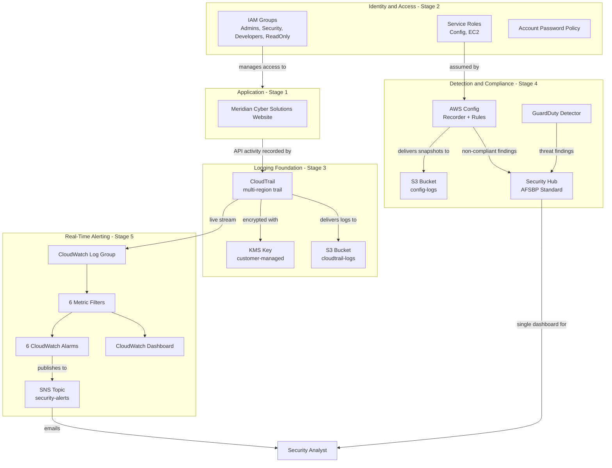

# Overall Platform Architecture

## Purpose

This document ties together every stage built so far into a single
picture: the identity foundation (IAM), the audit trail (CloudTrail +
KMS), the detection and compliance layer (GuardDuty, Security Hub, AWS
Config), the real-time alerting layer (CloudWatch + SNS), and the
public-facing website these controls protect.

## Company Context

This platform is built for a fictional cybersecurity consulting company,
Meridian Cyber Solutions, whose own marketing website is hosted inside
the same AWS account it secures - the website's Security page
(`website/security.html`) is kept in sync with the real controls
described in this repository's `docs/` folder.

## Full Architecture Diagram

## Stage-by-Stage Summary

| Stage | Services | Documentation |
|---|---|---|
| 1 | S3 + CloudFront website hosting | website source in `website/` |
| 2 | IAM groups, roles, password policy | `docs/iam.md` |
| 3 | CloudTrail, KMS, encrypted log storage | `docs/cloudtrail.md` |
| 4 | GuardDuty, Security Hub, AWS Config | `docs/guardduty.md`, `docs/securityhub.md`, `docs/config.md`, `docs/incident-response.md` |
| 5 | CloudWatch Logs, metric filters, alarms, SNS | `docs/cloudwatch.md` |

## Design Principles Followed Throughout

- **Least privilege everywhere:** every IAM group, role, and bucket policy
  grants only the specific permissions required for its job.
- **Defense in depth:** no single control is relied on alone - for
  example, a public bucket would be caught by both a Config rule and a
  Security Hub standard check.
- **Detection feeds one dashboard:** GuardDuty and Config findings both
  flow into Security Hub, so an analyst never has to check more than one
  place to see the account's overall security posture.
- **Detection is paired with real-time notification:** every high-risk
  pattern this platform watches for (root usage, failed logins, IAM/
  security-group changes, logging tampering, unauthorized calls) reaches
  a human via SNS within minutes, not just a dashboard someone has to
  remember to check.
- **Cost-consciousness:** every design decision explicitly calls out
  Free Tier impact and cost trade-offs (for example, choosing SSE-S3 over
  a second KMS key for the Config bucket) in code comments.

## What's Still Planned

Future stages will add S3 + CloudFront for production website hosting,
and a final documentation pass covering the complete resume summary and
a full technical/behavioral interview question bank.
