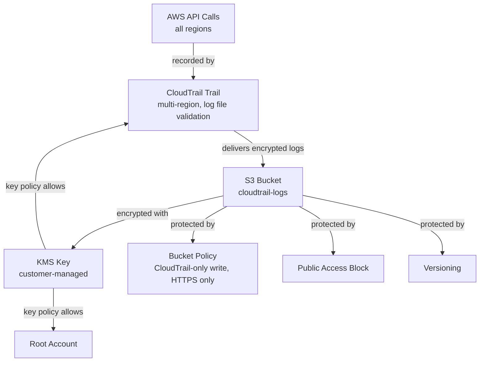

# CloudTrail, Encrypted Log Storage, and KMS

## Purpose

This stage adds account-wide activity logging to the platform. AWS CloudTrail
is the single most important service in a security monitoring stack: it is
the audit trail that records every API call made in the account, and it is
the data source that GuardDuty, Security Hub, and AWS Config build on top of
in later stages. Without CloudTrail turned on, there is nothing for the rest
of the platform to detect, investigate, or alert on.

## Architecture

## What We Built

### KMS Customer-Managed Key (`terraform/kms.tf`)
- **What it does:** Creates an encryption key that Meridian Cyber Solutions
  owns and controls, instead of relying on an AWS-managed key.
- **Why a company uses it:** Compliance frameworks such as PCI-DSS, HIPAA,
  and SOC 2 require sensitive logs to be encrypted with a key the customer
  can audit, rotate, and revoke independently of the data itself.
- **Why it's a security best practice:** The key policy is the single
  source of truth for who may use the key. It explicitly grants the root
  account full control (so the key can never be permanently locked), lets
  the CloudTrail service encrypt new logs, and lets the account decrypt
  logs it created - nothing more.
- **Common mistakes avoided:** Forgetting the root account statement (which
  can permanently orphan a key), and granting `Principal: "*"` which would
  let any authenticated AWS identity anywhere use the key.

### Encrypted, Versioned S3 Log Bucket (`terraform/cloudtrail.tf`)
- **What it does:** Stores every CloudTrail log file that is generated.
- **Why a company uses it:** Investigators and auditors need a durable,
  tamper-resistant place to review historical account activity, sometimes
  months after an incident occurred.
- **Why it's a security best practice:** Versioning prevents an attacker
  (or a mistaken script) from permanently destroying evidence by deleting
  or overwriting a log object. The public access block and HTTPS-only
  bucket policy ensure logs can never be exposed to the internet.
- **Common mistakes avoided:** Leaving a logging bucket without a public
  access block, and using SSE-S3 instead of a customer-managed KMS key.

### Multi-Region CloudTrail Trail (`terraform/cloudtrail.tf`)
- **What it does:** Turns on logging for management events (read and
  write) across every AWS region, plus global services like IAM.
- **Why a company uses it:** Attackers sometimes deliberately operate in a
  region the security team does not normally use, hoping activity there
  goes unnoticed. A multi-region trail closes that gap.
- **Why it's a security best practice:** Log file validation adds hourly
  SHA-256 digest files so the integrity of delivered logs can be
  cryptographically proven during an investigation or audit.
- **Common mistakes avoided:** Enabling CloudTrail in a single region only,
  and skipping log file validation, which removes the ability to prove logs
  were not altered after the fact.

## Resume-Ready Bullet Points

- Implemented account-wide, multi-region AWS CloudTrail logging with log
  file validation, delivering tamper-evident audit logs to a versioned,
  KMS-encrypted S3 bucket using Terraform.
- Authored a least-privilege KMS key policy restricting log encryption and
  decryption to the CloudTrail service and the owning AWS account.

## Interview Questions and Answers

**1. What is the difference between a management event and a data event in
CloudTrail?**
Management events capture control-plane operations, such as creating a
user or launching an instance. Data events capture high-volume data-plane
activity, like individual S3 object reads. This project logs management
events, since they are the highest-value signal for detecting attacker
activity while staying within Free Tier limits.

**2. Why enable CloudTrail across every region instead of just the region
you actively use?**
Attackers often try under-monitored regions specifically to avoid
detection. A multi-region trail guarantees every region is logged the same
way, so there is no blind spot to exploit.

**3. Why does the log bucket need its own KMS key instead of using S3's
default encryption?**
A customer-managed key lets the account control exactly who can decrypt
the logs through an auditable key policy, supports key rotation, and
satisfies compliance frameworks that require customer-controlled
encryption for audit data.

**4. How does log file validation help during an investigation?**
CloudTrail periodically writes a signed digest file summarizing the log
files delivered in that period. An investigator can use this digest to
cryptographically confirm that a log file has not been modified or deleted
since it was written, which strengthens the evidentiary value of the logs.

**5. What would you check first if CloudTrail stopped delivering logs to
the S3 bucket?**
I would check the bucket policy for a recent change that might block
`s3:PutObject` from the CloudTrail service, confirm the KMS key policy
still allows CloudTrail to call `GenerateDataKey`, and review CloudTrail's
own status/health in the console for a delivery error.

## Screenshots To Capture For GitHub

- AWS Console: CloudTrail > Trails, showing the trail with multi-region
  logging enabled and log file validation turned on.
- AWS Console: the S3 bucket's Properties tab showing versioning and
  default encryption (SSE-KMS) enabled.
- AWS Console: KMS > Customer managed keys, showing the CloudTrail key and
  its key policy.
- A sample CloudTrail log file (or digest file) opened in the S3 console.

## Suggestions To Reach Enterprise Standards

- Add CloudWatch Logs integration so CloudTrail events can trigger
  real-time metric filters and alarms (planned in the CloudWatch stage).
- Add an S3 Lifecycle rule to transition older logs to S3 Glacier for
  cost-effective long-term retention.
- Enable CloudTrail Insights to automatically flag unusual API call
  volume, such as a spike in failed console logins.
- Replicate the log bucket to a separate, locked-down "log archive"
  AWS account, so logs survive even if the primary account is compromised.
