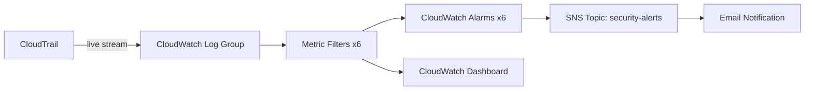

# CloudWatch + SNS - Real-Time Security Alerting

## Purpose

Stages 3 and 4 built durable logging (CloudTrail to S3) and periodic
compliance checks (AWS Config, Security Hub). This stage closes the
remaining gap: real-time alerting. CloudTrail events are streamed live
into CloudWatch Logs, six metric filters watch for specific high-risk
patterns, and a CloudWatch Alarm per pattern notifies an SNS topic the
moment it fires - turning a log line nobody may ever read into an email
within minutes.

## Architecture

## What We Built

- **CloudWatch Log Group** (`terraform/cloudwatch.tf`) with 90-day
  retention, fed by a dedicated IAM role that can only write to this one
  log group.
- **Six log metric filters**, each turning a specific CloudTrail event
  pattern into a numeric metric.
- **Six CloudWatch Alarms**, one per metric, each notifying the SNS topic
  the moment its threshold is breached.
- **One SNS topic** (`terraform/sns.tf`) with an email subscription and a
  topic policy restricted to this account's CloudWatch Alarms only.
- **One CloudWatch Dashboard** visualizing all six metrics over time.

## Alert Scenarios

### 1. Multiple Failed Console Login Attempts
- **How CloudWatch detects it:** The `failed-console-logins` metric
  filter matches CloudTrail `ConsoleLogin` events where
  `errorMessage = "Failed authentication"`.
- **Metric/log used:** `FailedConsoleLoginCount` in the
  `<project>/security` namespace.
- **Alarm triggered:** Fires when 3 or more failures occur within a
  5-minute window.
- **SNS notification:** An email naming the alarm
  `<project>-failed-console-logins` is sent to the subscribed address.
- **SOC investigation:** Check CloudTrail for the source IP and
  targeted username across the failed attempts; check GuardDuty for a
  related `UnauthorizedAccess:IAMUser/ConsoleLoginSuccess.B` finding if a
  login eventually succeeded.
- **Remediation:** Force a password reset for the targeted user, enable
  or verify MFA is required, and consider an IP-based block if the
  source is clearly malicious.

### 2. Root Account Usage
- **How CloudWatch detects it:** The `root-account-usage` filter matches
  any event where `userIdentity.type = "Root"` and the action was not
  invoked by another AWS service.
- **Metric/log used:** `RootAccountUsageCount`.
- **Alarm triggered:** Fires on any single root action (threshold = 1).
- **SNS notification:** Immediate email - root usage should be rare
  enough that every occurrence deserves a look.
- **SOC investigation:** Confirm whether the usage was planned
  (an approved break-glass procedure) or unexpected. Review exactly what
  action the root user performed via CloudTrail.
- **Remediation:** If unplanned, treat as a potential compromise: rotate
  the root password, check/remove any root access keys, and review
  recent IAM changes for signs of persistence.

### 3. IAM Policy Changes
- **How CloudWatch detects it:** The `iam-policy-changes` filter matches
  16 IAM policy-related event names (create/put/delete/attach/detach for
  policies, users, groups, and roles).
- **Metric/log used:** `IAMPolicyChangeCount`.
- **Alarm triggered:** Fires on any single matching event.
- **SNS notification:** Immediate email identifying that an IAM policy
  change occurred.
- **SOC investigation:** Identify who made the change and to which
  identity, and compare the new policy against least-privilege
  expectations (also flagged separately by the AWS Config
  `iam-policy-no-statements-with-admin-access` rule from Stage 4).
- **Remediation:** Revert unauthorized or overly broad changes, and if
  the change was made by a compromised identity, disable that identity
  immediately.

### 4. Security Group Changes
- **How CloudWatch detects it:** The `security-group-changes` filter
  matches security group create/delete/authorize/revoke events.
- **Metric/log used:** `SecurityGroupChangeCount`.
- **Alarm triggered:** Fires on any single matching event.
- **SNS notification:** Immediate email naming the alarm.
- **SOC investigation:** Identify the specific rule added or removed,
  and whether it opens access from `0.0.0.0/0` (also flagged separately
  by the AWS Config `restricted-ssh` rule for port 22 specifically).
- **Remediation:** Remove the overly permissive rule and restrict access
  to specific, known IP ranges or remove direct inbound access entirely.

### 5. CloudTrail Stopped or Modified
- **How CloudWatch detects it:** The `cloudtrail-stopped-or-modified`
  filter matches `StopLogging`, `DeleteTrail`, and `UpdateTrail` events.
- **Metric/log used:** `CloudTrailChangeCount`.
- **Alarm triggered:** Fires on any single matching event.
- **SNS notification:** Immediate email - this is one of the highest-
  priority alerts in the whole platform, since it can indicate an
  attacker trying to disable logging to cover their tracks.
- **SOC investigation:** Because this could mean logging has just been
  disabled, investigate using whatever logs still exist (VPC Flow Logs,
  the CloudWatch Logs already delivered, service-specific logs) and
  treat this as a high-severity incident by default.
- **Remediation:** Re-enable the trail immediately, review IAM
  permissions to ensure only a very small number of trusted
  administrators can modify CloudTrail, and investigate everything that
  happened around the time logging was stopped.

### 6. Unauthorized API Calls
- **How CloudWatch detects it:** The `unauthorized-api-calls` filter
  matches CloudTrail events with an `errorCode` of `AccessDenied*` or
  `*UnauthorizedOperation`.
- **Metric/log used:** `UnauthorizedApiCallCount`.
- **Alarm triggered:** Fires when 5 or more denied calls occur within a
  5-minute window (a higher threshold than the others, since a handful
  of access-denied errors can happen during normal troubleshooting).
- **SNS notification:** Email naming the alarm once the threshold is
  crossed.
- **SOC investigation:** Identify which identity is generating the
  denied calls and what it is attempting to do - this is a classic
  signature of an attacker (or a compromised credential) probing for
  permissions it does not have.
- **Remediation:** If the identity is compromised, disable it
  immediately; if it is a legitimate but misconfigured application, fix
  its IAM policy rather than granting broad access to make the errors
  stop.

## Resume-Ready Bullet Points

- Built a real-time security alerting pipeline using CloudWatch Logs
  metric filters, CloudWatch Alarms, and Amazon SNS, detecting six
  high-risk event patterns within minutes of occurrence.
- Designed a CloudWatch Dashboard consolidating root account usage,
  failed logins, IAM/security-group changes, CloudTrail tampering, and
  unauthorized API calls into a single operational view.

## Interview Questions and Answers

### CloudWatch

**1. What is a CloudWatch Logs metric filter?**
It's a pattern applied to incoming log events that converts matching
lines into a numeric CloudWatch metric, which can then be alarmed on
like any other metric.

**2. Why use `treat_missing_data = "notBreaching"` on these alarms?**
Because zero matching events is the normal, healthy state for security
alarms like these. Without this setting, a quiet period could put the
alarm into `INSUFFICIENT_DATA` instead of the correct `OK` state.

**3. Why send CloudTrail logs to both S3 and CloudWatch Logs instead of
just one?**
They serve different purposes: S3 provides durable, cost-effective,
long-term storage for audits and forensics, while CloudWatch Logs
enables real-time pattern matching and alarms. Using both is standard
practice.

**4. How would you reduce alert fatigue from these alarms?**
Tune thresholds appropriately (as done here with a higher threshold for
unauthorized API calls than for root usage), route different severities
to different notification channels, and periodically review which
alarms fire often but rarely indicate real incidents.

**5. What CloudWatch Dashboard would you build for a SOC team?**
One combining the security-relevant metrics from this project (root
usage, failed logins, policy/security-group changes, logging health,
unauthorized calls) alongside GuardDuty finding counts and Security Hub
compliance score, giving a single real-time operational view.

### SNS

**1. Why does an SNS email subscription require confirmation?**
It's an anti-abuse/anti-spam safeguard - AWS requires proof that the
address owner actually wants to receive messages before any are
delivered, and Terraform cannot click that confirmation link for you.

**2. What is an SNS topic policy and why does this project need one?**
It's a resource policy defining who may publish to or subscribe to a
topic. Without explicitly allowing `cloudwatch.amazonaws.com` to publish,
CloudWatch Alarms would not be able to deliver messages to the topic.

**3. How could this SNS topic be extended beyond email?**
Additional subscriptions could be added for SMS, an AWS Chatbot
integration posting to Slack/Microsoft Teams, or a Lambda function that
opens a ticket in an incident-management system - all without changing
any of the alarms themselves.

**4. Why restrict the topic policy to `aws:SourceOwner` equal to this
account?**
To prevent any other AWS account from publishing fake or malicious
messages into this topic - only alarms belonging to this account are
trusted to trigger notifications.

**5. What is the difference between SNS and SQS, and why is SNS used
here rather than SQS?**
SNS is a pub/sub push service - ideal for fanning a single alert out to
multiple subscribers (email, SMS, Lambda) immediately. SQS is a pull-
based queue better suited for decoupling application workloads. Alerting
a human in real time is exactly SNS's use case.

## Screenshots To Capture For GitHub

- AWS Console: CloudWatch > Log groups, showing the CloudTrail log group
  and its retention setting.
- AWS Console: CloudWatch > Alarms, showing all six alarms in the OK
  state.
- AWS Console: CloudWatch > Dashboards, showing the security monitoring
  dashboard.
- AWS Console / email: a sample SNS notification email once the
  subscription is confirmed.

## Suggestions To Reach Enterprise SOC Standards

- Add an EventBridge rule + Lambda function for automatic triage or
  auto-remediation of well-understood alerts (for example, automatically
  re-closing a security group rule that opens SSH to the world).
- Route different alarms to different SNS topics by severity (e.g. a
  'Critical' topic that also pages on-call via a service like
  PagerDuty/Opsgenie, versus a 'Info' topic that only emails).
- Add CloudWatch Composite Alarms to reduce noise when multiple related
  alarms fire from the same underlying incident.
- Layer in VPC Flow Logs metric filters for network-level visibility
  alongside these account-activity-level alarms.
