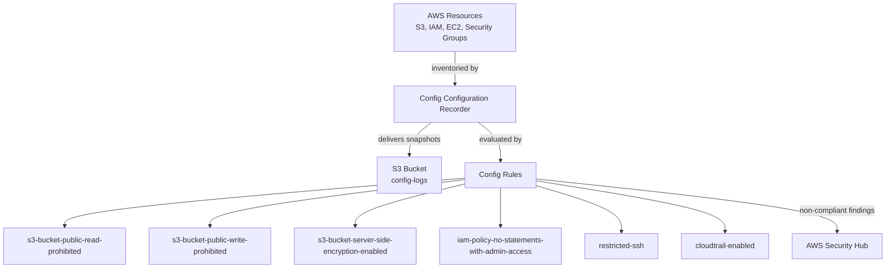

# AWS Config - Configuration Compliance Monitoring

## Purpose

AWS Config takes a continuous inventory of every supported resource in the
account, records every configuration change over time, and evaluates each
resource against rules the account owner chooses. This project uses it to
continuously check for the exact conditions described in this project's
threat scenarios: public S3 buckets, unencrypted storage, overly
permissive IAM policies, and security groups open to the internet.

## Architecture

## What We Built

### Configuration Recorder + Delivery Channel (`terraform/config.tf`)
- **What it does:** Turns on Config, watching every supported resource
  type (including global services like IAM), and delivers configuration
  history/snapshots to a dedicated, encrypted S3 bucket.
- **Why a company uses it:** Cloud environments change constantly. Config
  answers 'what changed, when, and by whom' - something manual,
  point-in-time audits cannot keep up with.
- **Why it's a security best practice:** `include_global_resource_types
  = true` ensures IAM changes are tracked, not just regional resources -
  a very common gap in first-time Config setups.
- **Common mistakes avoided:** Turning on the recorder without a delivery
  channel (Config will reject this), and leaving the Config S3 bucket
  without the same public-access protections used for CloudTrail.

### AWS-Managed Config Rules (`terraform/config.tf`)
- **What they do:** Six automated compliance checks, each mapped to one
  of this project's threat scenarios (see `docs/incident-response.md`):
  public read/write S3 access, missing S3 encryption, admin-style IAM
  policies, unrestricted inbound SSH, and CloudTrail being disabled.
- **Why a company uses them:** They turn a written security policy
  ('buckets must never be public') into an automatically and continuously
  enforced check, instead of relying on someone remembering to look.
- **Why it's a security best practice:** Using AWS-managed rules (source
  owner `AWS`) means no custom Lambda evaluation logic to write, test, or
  maintain ourselves.
- **Common mistakes avoided:** Writing custom rules for checks AWS already
  provides out of the box, which adds unnecessary maintenance burden.

## How AWS Config Would Detect a Non-Compliant Resource

When a tracked resource changes (for example, a bucket policy is edited to
allow public read access), Config re-evaluates every rule that applies to
that resource type within minutes, marks the resource `NON_COMPLIANT` in
the Config console, records the specific change in its configuration
timeline, and forwards that non-compliant finding to Security Hub for
triage alongside GuardDuty findings.

## Resume-Ready Bullet Point

- Deployed AWS Config with a custom recorder, delivery channel, and six
  managed compliance rules covering S3 exposure, encryption, IAM
  over-permissioning, and network exposure, using Terraform.

## Interview Questions and Answers

**1. What is the difference between the Configuration Recorder and a
Config Rule?**
The recorder is what actually inventories resources and records their
configuration history. Rules are separate, optional evaluations applied on
top of that recorded data to check for compliance against a desired state.

**2. Why must `include_global_resource_types` be set to true?**
IAM is a global service, not tied to any one region. Without this setting,
Config would never record or evaluate IAM users, roles, or policies at
all, leaving a significant blind spot.

**3. How does AWS Config differ from CloudTrail?**
CloudTrail records the individual API calls that changed something.
Config records and evaluates the resulting state/configuration of
resources over time, and can tell you if that state is compliant. They are
complementary - CloudTrail often used to determine who made a change
that Config flagged.

**4. What would you check if a Config rule was stuck in INSUFFICIENT_DATA
status?**
I would confirm the configuration recorder is actually running (recorder
status resource enabled), that the IAM role Config uses has the necessary
read permissions for that resource type, and that at least one matching
resource exists in the account for the rule to evaluate.

**5. How could AWS Config findings be used to automatically remediate a
problem?**
Config supports Remediation Configurations that can trigger an SSM
Automation document (for example, to automatically re-enable S3 Block
Public Access) as soon as a resource is marked non-compliant, without a
human needing to intervene.

## Screenshots To Capture For GitHub

- AWS Console: Config > Rules, showing all six rules and their compliance
  status.
- AWS Console: Config > Resources, showing the resource inventory.
- AWS Console: Config > Settings, showing the recorder enabled with
  `include_global_resource_types` on.

## Suggestions To Reach Enterprise Standards

- Add AWS Config Conformance Packs to map rules directly to a framework
  such as CIS AWS Foundations Benchmark or NIST 800-53.
- Add Remediation Configurations so common findings (like a public S3
  bucket) are fixed automatically within minutes of detection.
- Aggregate Config data across multiple accounts using an AWS
  Organizations Config aggregator, for teams managing more than one
  account.
