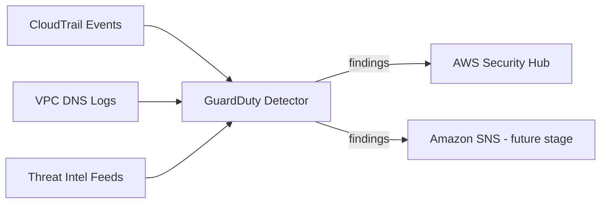

# Amazon GuardDuty - Threat Detection

## Purpose

GuardDuty is a managed threat-detection service that continuously analyzes
CloudTrail management events and VPC DNS query logs, comparing them against
AWS threat-intelligence feeds and machine-learning models. It requires no
detection rules to write or maintain - AWS manages the detection logic and
updates it as new threats are discovered.

## Architecture

## What We Built

### GuardDuty Detector (`terraform/guardduty.tf`)
- **What it does:** Turns on account-wide threat detection with the
  fastest available finding-publish frequency (15 minutes).
- **Why a company uses it:** It catches things a human reviewing logs
  would likely miss - a compromised credential used from an unusual
  location, an EC2 instance contacting a known cryptomining domain, or a
  port scan against the account's public IP ranges.
- **Why it's a security best practice:** Findings flow automatically into
  Security Hub, so the security team has one dashboard instead of many.
- **Common mistakes avoided:** Enabling GuardDuty and never assigning
  anyone to review findings; forgetting that GuardDuty bills based on
  event volume after a 30-day free trial (for a low-traffic demo account
  this is typically cents to a few dollars per month, not free forever).

## How GuardDuty Findings Would Appear

GuardDuty findings follow a consistent naming pattern of
`ThreatPurpose:ResourceType/DetectionMechanism`. Examples relevant to this
project's threat scenarios include `UnauthorizedAccess:IAMUser/
ConsoleLoginSuccess.B` (a console login from an unusual location),
`Recon:IAMUser/UserPermissions` (a principal enumerating permissions,
often a precursor to privilege escalation), and `Policy:IAMUser/
RootCredentialUsage` (the root account being used at all). Each finding
includes a severity score (Low/Medium/High), the affected resource, and
the supporting evidence (IP address, API call, timestamp).

## Resume-Ready Bullet Point

- Deployed Amazon GuardDuty for continuous, intelligence-driven threat
  detection across account activity and network metadata using Terraform.

## Interview Questions and Answers

**1. What data sources does GuardDuty analyze by default?**
By default GuardDuty analyzes CloudTrail management events and VPC DNS
query logs. Additional paid features can add S3 data event analysis,
EKS audit log analysis, and EBS malware scanning.

**2. How does GuardDuty differ from AWS Config?**
GuardDuty is a threat-detection service that looks for signs of active
malicious or anomalous behavior. AWS Config is a configuration-compliance
service that checks whether resources match a desired state. They are
complementary, not overlapping.

**3. What is a GuardDuty finding's severity score used for?**
Severity (Low, Medium, High) helps a security team triage: a High severity
finding, such as evidence of an actively compromised instance, should be
investigated immediately, while Low severity findings can be reviewed on a
routine cadence.

**4. Why does this project set finding_publishing_frequency to 15
minutes instead of the 6-hour default?**
During an active incident, minutes matter. Publishing findings as quickly
as possible gets them into Security Hub and any downstream alerting sooner,
reducing the time between compromise and detection.

**5. If GuardDuty raised a finding for an EC2 instance communicating with
a known command-and-control IP, what would you do first?**
I would isolate the instance (for example, by changing its security group
to remove all outbound access or moving it to a quarantine subnet),
snapshot it for forensic review, then investigate the CloudTrail history
for that instance's role to see what else it may have accessed.

## Screenshots To Capture For GitHub

- AWS Console: GuardDuty > Summary, showing the detector enabled.
- AWS Console: GuardDuty > Settings, showing the 15-minute finding
  publishing frequency.
- If any sample findings are generated (GuardDuty supports generating
  sample findings for demonstration), a screenshot of the findings list.

## Suggestions To Reach Enterprise Standards

- Enable S3 protection and EKS protection features as the account and
  workloads mature (commented out in `guardduty.tf` for cost control).
- Route High severity findings to a dedicated incident-response SNS topic
  or a ticketing system integration.
- Use GuardDuty's trusted IP list / threat list features to reduce false
  positives for known-safe internal IP ranges.
