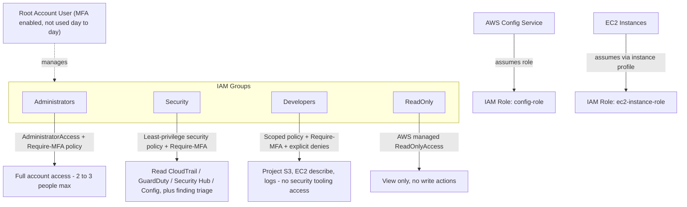

# IAM Foundations

## Purpose

Identity and Access Management (IAM) is the front door of an AWS account. Every other control in this project - CloudTrail, GuardDuty, Security Hub, Config - assumes that the identity layer underneath it is sound. If IAM is loose (shared credentials, overly broad policies, no MFA), an attacker who compromises a single set of credentials can often disable logging and detection before anyone notices. This document describes the IAM structure built in `terraform/iam.tf`: the account password policy, four IAM groups used to separate duties, the least-privilege policies attached to each group, two service roles that let AWS services act on our behalf, and a small set of example IAM users used to demonstrate the structure.

## Architecture Diagram

## Account Password Policy

**What it does.** Enforces a 14-character minimum, a mix of character types, a 90-day rotation window, and prevents reusing the last 24 passwords for every IAM user who signs in with a password.

**Why a company uses it.** Weak, reused, or ancient passwords are still one of the most common initial access vectors in real breaches. A password policy is a blunt but effective control that removes the weakest passwords from the pool before an attacker ever gets a chance to guess or credential-stuff them.

**Why it is a security best practice.** It is also the first line item checked by the CIS AWS Foundations Benchmark, which Security Hub can evaluate automatically - so this single resource contributes directly to the compliance score shown later in the project.

**Common mistakes.** Setting `max_password_age` without also setting `allow_users_to_change_password = true` locks users out instead of rotating their credentials, since they have no way to update their own password before it expires.

## IAM Groups and Least-Privilege Policies

### Administrators

Attached to the AWS managed `AdministratorAccess` policy. This group should stay extremely small in a real company (two or three people), and every member should be required to use hardware or app-based MFA. Full admin access is powerful specifically because it is rarely needed for day-to-day work - most operational tasks fit inside a narrower role.

### Security

A custom policy (`SecurityTeamLeastPrivilege`) that grants read access to CloudTrail, GuardDuty, Security Hub, Config, CloudWatch, and SNS, plus just enough write access (`securityhub:BatchUpdateFindings`, `guardduty:UpdateFindingsFeedback`, `guardduty:ArchiveFindings`) to triage findings. This mirrors how a real SOC or security engineering team is scoped: broad visibility, narrow ability to change unrelated infrastructure.

### Developers

A custom policy (`DevelopersLeastPrivilege`) scoped to the project S3 bucket, basic EC2 visibility, and log access for debugging - with an explicit `Deny` statement blocking IAM changes and any action that would stop CloudTrail, disable GuardDuty, disable Security Hub, or stop AWS Config. Explicit denies matter because they cannot be overridden by any other policy attached later, which protects against accidental privilege creep as more policies get added over time.

### ReadOnly

Uses the AWS managed `ReadOnlyAccess` policy. Appropriate for auditors, new hires during onboarding, or anyone who needs visibility without the ability to change anything.

## Require-MFA Policy

A custom policy attached to Administrators, Security, and Developers (every group except ReadOnly, since ReadOnly already cannot make changes). It allows the small set of actions needed to view account info and enroll an MFA device, then denies almost everything else unless `aws:MultiFactorAuthPresent` is true. This is the enforcement mechanism behind "MFA is required" - without a policy like this, MFA is only a recommendation, not a technical control.

## Service Roles

**config-role** - assumed directly by the AWS Config service (`config.amazonaws.com`), using the AWS managed `AWS_ConfigRole` policy, so Config can read resource configurations and write results without borrowing a human user's credentials.

**ec2-instance-role** - assumed by EC2 instances via an instance profile, with the SSM and CloudWatch Agent managed policies attached. This is what lets an EC2 instance send logs and metrics to CloudWatch and be managed through Systems Manager without ever storing an access key on disk. Long-lived access keys on an instance are a common real-world weakness, since a compromised instance then hands the attacker standing credentials.

## Example Demo IAM Users

Four demo users (`demo-admin`, `demo-security-analyst`, `demo-developer`, `demo-auditor`) are created and placed into their matching groups purely to prove the group structure works. No console passwords or access keys are generated in code - creating real, usable credentials inside version-controlled infrastructure code is a common and serious mistake. If you want to actually sign in as one of these users, set a console password manually after applying the configuration and enable MFA immediately.

## Root Account vs. IAM Users

The AWS root user is the account owner and can never be fully restricted by IAM policy. Best practice, followed in this project conceptually (Terraform cannot manage the root user directly), is: enable MFA on root, do not create or use access keys for root, and use root only for the handful of tasks that genuinely require it (closing the account, changing the support plan, and a few others). All day-to-day work, including the Administrators group above, happens through IAM identities instead.

## MFA Recommendations

Every human identity in this account - root and all four groups except where technically impossible - should have MFA enabled. App-based authenticators (TOTP) are the free-tier-friendly option; hardware security keys are the enterprise standard for highly privileged accounts like Administrators.

## Common Mistakes Summary

Using the AWS managed `AdministratorAccess` policy for every user instead of scoping by role, forgetting to escape IAM policy variables like `$${aws:username}` in Terraform (which either breaks the plan or silently produces an incorrect policy), storing access keys on EC2 instances instead of using instance roles, and setting password expiration without allowing self-service password changes are the most common mistakes this design specifically avoids.
