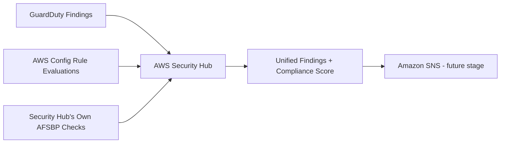

# AWS Security Hub - Central Findings and Compliance Dashboard

## Purpose

Security Hub is the aggregation layer for this platform. It does not
generate findings on its own; instead it automatically collects and
normalizes findings from GuardDuty and AWS Config into one common finding
format (AWS Security Finding Format), and runs its own automated Security
Standards checks against the account, producing an overall compliance
score.

## Architecture

## What We Built

### Security Hub Account (`terraform/securityhub.tf`)
- **What it does:** Turns on Security Hub for the account/region and
  enables the AWS Foundational Security Best Practices (AFSBP) standard -
  roughly 200 automated checks AWS itself maintains and updates.
- **Why a company uses it:** Without Security Hub, an analyst has to check
  GuardDuty, Config, and other consoles separately. Security Hub gives one
  dashboard, one compliance score, and one place to route findings to a
  ticketing or SOAR tool.
- **Why it's a security best practice:** Findings from every integrated
  service appear here automatically within minutes, with no custom
  integration work required.
- **Common mistakes avoided:** Enabling Security Hub but never enabling a
  standard (which gives an aggregation view with no automated checks), and
  treating Security Hub as a replacement for GuardDuty/Config rather than
  the downstream aggregator that it actually is.

## How Security Hub Recommendations Would Appear

Each AFSBP control produces a finding with a title (for example, 'S3.8
Block Public Access setting should be enabled'), a severity, the specific
non-compliant resource ARN, and a 'Remediation' link pointing to AWS
documentation with the exact console steps or CLI command to fix it. The
account also receives an overall security score (a percentage of passed
checks) that trends up or down as resources are fixed or newly created.

## Resume-Ready Bullet Point

- Enabled AWS Security Hub with the AWS Foundational Security Best
  Practices standard to aggregate and score findings from GuardDuty and
  AWS Config in a single dashboard, deployed via Terraform.

## Interview Questions and Answers

**1. What problem does Security Hub solve that GuardDuty and Config don't
solve on their own?**
It solves fragmentation. Without it, a team must check multiple consoles
separately. Security Hub normalizes findings from many services into one
format and one dashboard, with an overall compliance score.

**2. What is the AWS Foundational Security Best Practices standard?**
It's AWS's own curated set of roughly 200 automated checks covering
identity, logging, networking, and data protection best practices across
services. It's commonly the first standard enabled in a new account.

**3. Can Security Hub automatically remediate findings?**
Not by itself out of the box, but it can trigger EventBridge rules that
invoke Lambda functions or Systems Manager Automation documents to
remediate certain findings automatically - a common enterprise pattern.

**4. How would you prioritize which Security Hub findings to fix first?**
I'd start with Critical/High severity findings on internet-facing or
production resources, particularly ones matching this project's threat
scenarios (public buckets, open security groups, over-permissive IAM),
since those have the most direct exploitation path.

**5. Does enabling Security Hub replace the need for GuardDuty or
Config?**
No. Security Hub is an aggregator - it has nothing to display if no
underlying service (GuardDuty, Config, Inspector, etc.) is generating
findings in the first place.

## Screenshots To Capture For GitHub

- AWS Console: Security Hub > Summary, showing the overall security score.
- AWS Console: Security Hub > Standards, showing AFSBP enabled with its
  pass/fail control count.
- AWS Console: Security Hub > Findings, filtered by severity.

## Suggestions To Reach Enterprise Standards

- Enable the CIS AWS Foundations Benchmark standard alongside AFSBP for
  broader coverage.
- Use Security Hub's cross-Region aggregation to get one view across all
  enabled regions in a multi-region account.
- Build an EventBridge + Lambda auto-remediation pipeline for a small set
  of well-understood, safe-to-automate findings.
